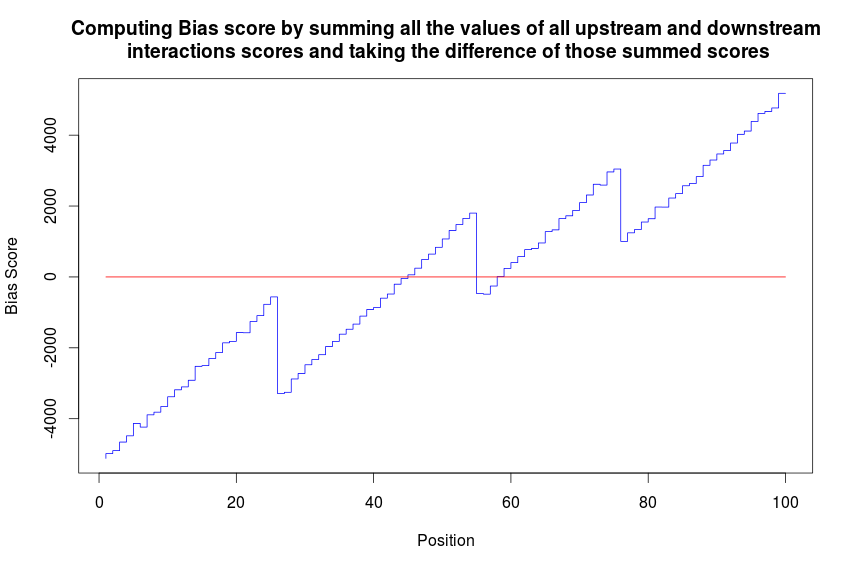
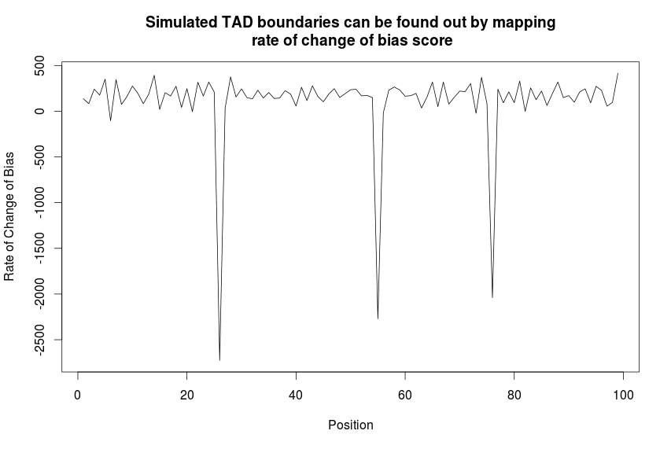

TADSimulation
=============

Testing potential Bias scores for finding TAD boundaries in this simulation

**Aims:** 

1. Creation of a Scoring metric to compute Bias in the number of interactions upstream and downstream of a an element along a
chromosome.
2. Use this Bias score to elucidate the boundaries of Topological Domains

**Methods:**

Simulated TADs were created as shown in the figure below.Deeper reds indicate higher interaction frequencies while white indicates zero interaction frequency. TADs are recreated at every simulation and can be seen as blocks that have a high interaction frequency between the elements. Background noise was also simulated, while self interaction frequency was set at zero.

Scoring was done using five different scoring metrics and TAD boundaries computed using rate of chagne the of scoring metrics.

**Description of Analysis:**

Five Scoring metrics were devised to find the best way of scoring bias. The scoring metrics are as follows:

1. U and D were computed where U is the sum of interaction frequencies of all elements upstream of the element and D is the sum of all interaction frequencies downstream of the element on the chromosome.
 * In the first metric the difference: U-D was taken each element: 
 * By taking the derivative of this plot the rate of change of bias was computed: 

2. U and D were computed where U is the sum of all interaction frequencies for elements upstream

