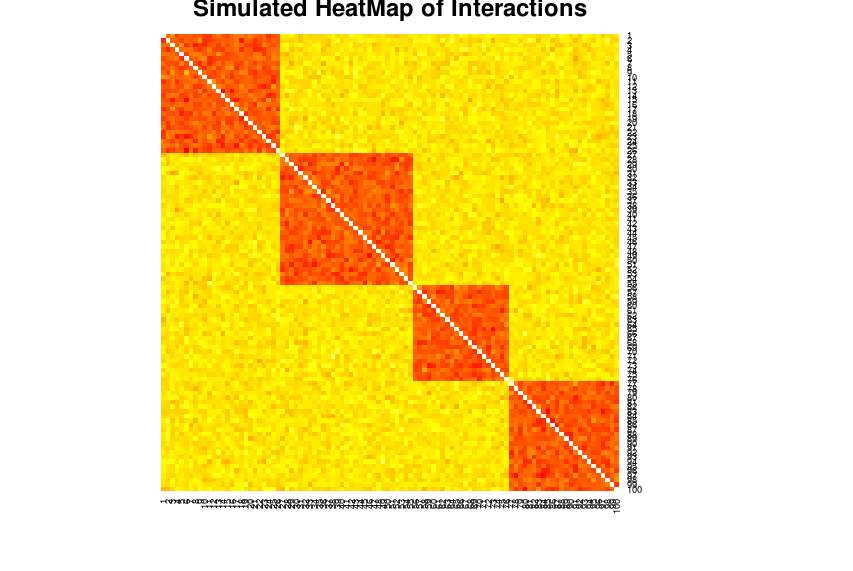

TADSimulation
=============

Testing potential Bias scores for finding TAD boundaries in this simulation

**Aims:** 

1. Creation of a Scoring metric to computer Bias in the number of interactions upstream and downstream of a an element along a
chromose.
2. Use this Bias score to elucidate the boundaries of Topological Domains

**Methods:**

Simulated TADs were created as shown in the first Plot. TADs are recreated at every simulation and can be seen as blocks that have
a high interaction frequency between the elements. Background noise was also simulated. See figure below:

Scoring was done using five different scoring metrics and TAD boundaries computed using each rate of chagne the of scoring metrics.

**Description of Analysis:**

Five Scoring metrics were devised to find the best way of scoring bias:

